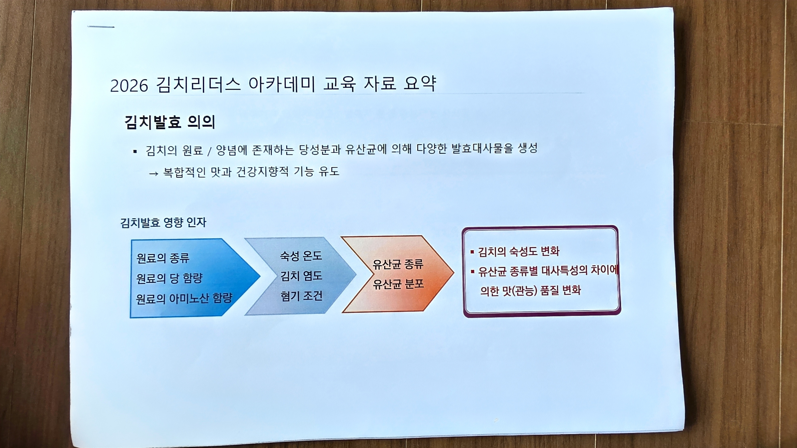

# 01. 김치발효 의의

> 출처: 2026 김치리더스 아카데미 교육 자료 요약
> 원본 스캔: `01_김치발효_의의.jpg`

## 김치발효 의의

- 김치의 원료 / 양념에 존재하는 당성분과 유산균에 의해 다양한 발효대사물을 생성
  - → 복합적인 맛과 건강지향적 기능 유도

## 김치발효 영향 인자

발효에 영향을 주는 인자들이 순차적으로 김치 품질에 작용한다.

| 단계 | 영향 인자 |
|---|---|
| 원료 | 원료의 종류 / 원료의 당 함량 / 원료의 아미노산 함량 |
| 발효 조건 | 숙성 온도 / 김치 염도 / 혐기 조건 |
| 미생물 | 유산균 종류 / 유산균 분포 |

**→ 결과 (품질 변화)**
- 김치의 숙성도 변화
- 유산균 종류별 대사특성의 차이에 의한 맛(관능) 품질 변화
