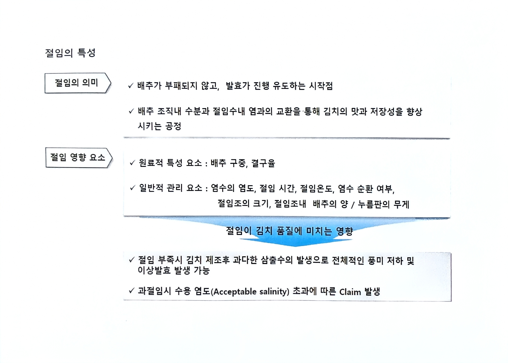

# 02. 절임의 특성

> 원본 스캔: `02_절임의_특성.jpg`

## 절임의 의미

- 배추가 부패되지 않고, 발효가 진행 유도하는 시작점
- 배추 조직내 수분과 절임수내 염과의 교환을 통해 김치의 맛과 저장성을 향상시키는 공정

## 절임 영향 요소

- **원료적 특성 요소**: 배추 구중, 결구율
- **일반적 관리 요소**: 염수의 염도, 절임 시간, 절임온도, 염수 순환 여부, 절임조의 크기, 절임조내 배추의 양 / 누름판의 무게

## 절임이 김치 품질에 미치는 영향

- 절임 부족시 김치 제조후 과다한 삼출수의 발생으로 전체적인 풍미 저하 및 이상발효 발생 가능
- 과절임시 수용 염도(Acceptable salinity) 초과에 따른 Claim 발생
