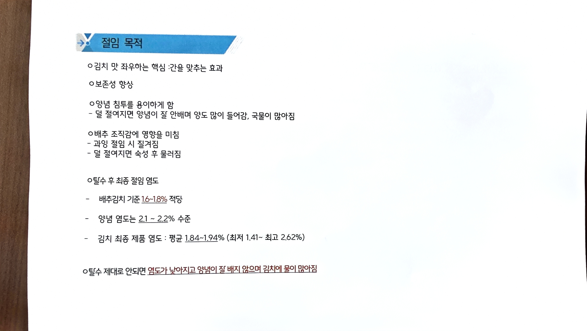

# 03. 절임 목적

> 원본 스캔: `03_절임_목적.jpg`

## 절임 목적

- **김치 맛 좌우하는 핵심**: 간을 맞추는 효과
- **보존성 향상**
- **양념 침투를 용이하게 함**
  - 덜 절여지면 양념이 잘 안배며 양도 많이 들어감, 국물이 많아짐
- **배추 조직감에 영향을 미침**
  - 과잉 절임 시 질겨짐
  - 덜 절여지면 숙성 후 물러짐

## 탈수 후 최종 절임 염도

- 배추김치 기준 **1.6~1.8%** 적당
- 양념 염도는 **2.1 ~ 2.2%** 수준
- 김치 최종 제품 염도: 평균 **1.84~1.94%** (최저 1.41 ~ 최고 2.62%)

- 탈수 제대로 안되면 염도가 낮아지고 양념이 잘 배지 않으며 김치에 물이 많아짐
