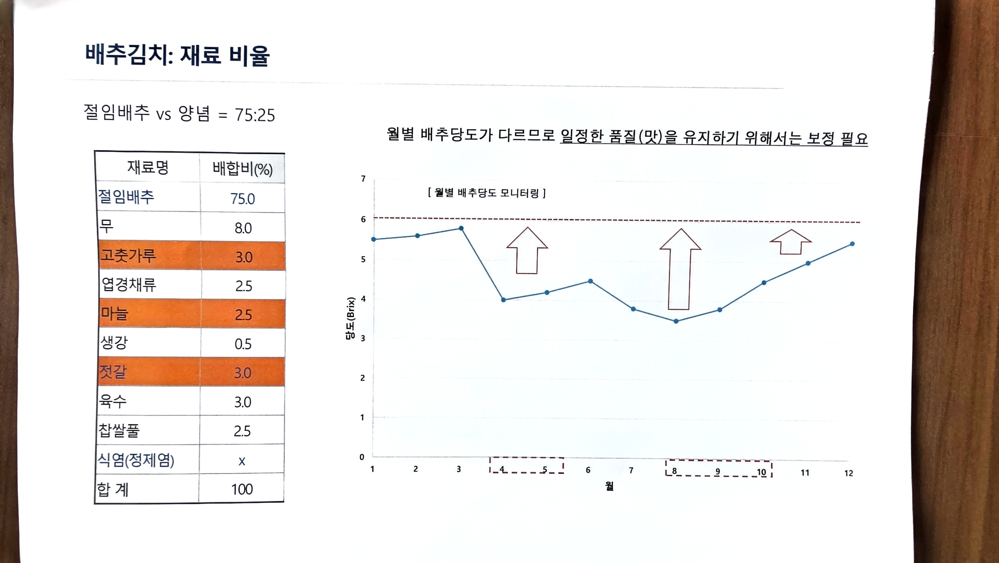

# 04. 배추김치: 재료 비율

> 원본 스캔: `04_배추김치_재료_비율.jpg`

## 절임배추 vs 양념 = 75 : 25

| 재료명 | 배합비(%) |
|---|---|
| 절임배추 | 75.0 |
| 무 | 8.0 |
| 고춧가루 | 3.0 |
| 엽경채류 | 2.5 |
| 마늘 | 2.5 |
| 생강 | 0.5 |
| 젓갈 | 3.0 |
| 육수 | 3.0 |
| 찹쌀풀 | 2.5 |
| 식염(정제염) | x |
| **합계** | **100** |

## 월별 배추당도 모니터링

> 월별 배추당도가 다르므로 일정한 품질(맛)을 유지하기 위해서는 **보정 필요**

- 그래프: 세로축 = 당도(Brix, 0~7), 가로축 = 월(1~12월)
- 기준선(점선): 약 6 Brix
- 당도가 낮아지는 시기(4~5월, 8~10월)에는 보정이 필요함 (그래프의 ↑ 표시 구간)
- 대략적 추이: 연초(1~3월) 5.5~5.8로 높음 → 4~5월 약 4.0으로 하락 → 8월 약 3.4로 최저 → 이후 상승하여 12월 약 5.4로 회복
