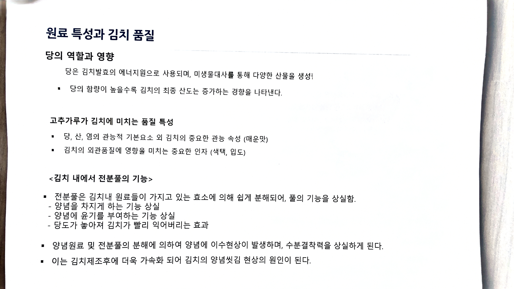

# 05. 원료 특성과 김치 품질

> 원본 스캔: `05_원료_특성과_김치_품질.jpg`

## 당의 역할과 영향

- 당은 김치발효의 에너지원으로 사용되며, 미생물대사를 통해 다양한 산물을 생성함
- 당의 함량이 높을수록 김치의 최종 산도는 증가하는 경향을 나타낸다.

## 고추가루가 김치에 미치는 품질 특성

- 당, 산, 염의 관능적 기본요소 외 김치의 중요한 관능 속성 (매운맛)
- 김치의 외관품질에 영향을 미치는 중요한 인자 (색택, 입도)

## 〈김치 내에서 전분풀의 기능〉

- 전분풀은 김치내 원료들이 가지고 있는 효소에 의해 쉽게 분해되어, 풀의 기능을 상실함.
  - 양념을 차지게 하는 기능 상실
  - 양념에 윤기를 부여하는 기능 상실
  - 당도가 높아져 김치가 빨리 익어버리는 효과
- 양념원료 및 전분풀의 분해에 의하여 양념에 이수현상이 발생하며, 수분결착력을 상실하게 된다.
- 이는 김치제조후에 더욱 가속화 되어 김치의 양념씻김 현상의 원인이 된다.
