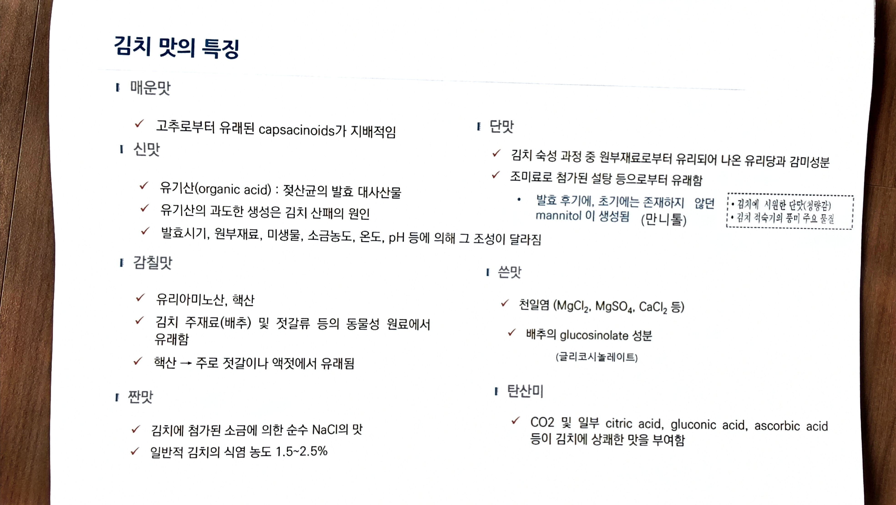

# 06. 김치 맛의 특징

> 원본 스캔: `06_김치_맛의_특징.jpg`

## 매운맛

- ✓ 고추로부터 유래된 capsacinoids가 지배적임

## 신맛

- ✓ 유기산(organic acid) : 젖산균의 발효 대사산물
- ✓ 유기산의 과도한 생성은 김치 산패의 원인
- ✓ 발효시기, 원부재료, 미생물, 소금농도, 온도, pH 등에 의해 그 조성이 달라짐

## 감칠맛

- ✓ 유리아미노산, 핵산
- ✓ 김치 주재료(배추) 및 젓갈류 등의 동물성 원료에서 유래함
- ✓ 핵산 → 주로 젓갈이나 액젓에서 유래됨

## 짠맛

- ✓ 김치에 첨가된 소금에 의한 순수 NaCl의 맛
- ✓ 일반적 김치의 식염 농도 1.5~2.5%

## 단맛

- ✓ 김치 숙성 과정 중 원부재료로부터 유리되어 나온 유리당과 감미성분
- ✓ 조미료로 첨가된 설탕 등으로부터 유래함
  - • 발효 후기에, 초기에는 존재하지 않던 mannitol 이 생성됨 (만니톨)

> (손글씨 메모, 점선 상자)
> - • 김치에 시원한 단맛(청량감)
> - • 김치 적숙기의 풍미 주요 물질

## 쓴맛

- ✓ 천일염 (MgCl₂, MgSO₄, CaCl₂ 등)
- ✓ 배추의 glucosinolate 성분 (글리코시놀레이트)

## 탄산미

- ✓ CO2 및 일부 citric acid, gluconic acid, ascorbic acid 등이 김치에 상쾌한 맛을 부여함
