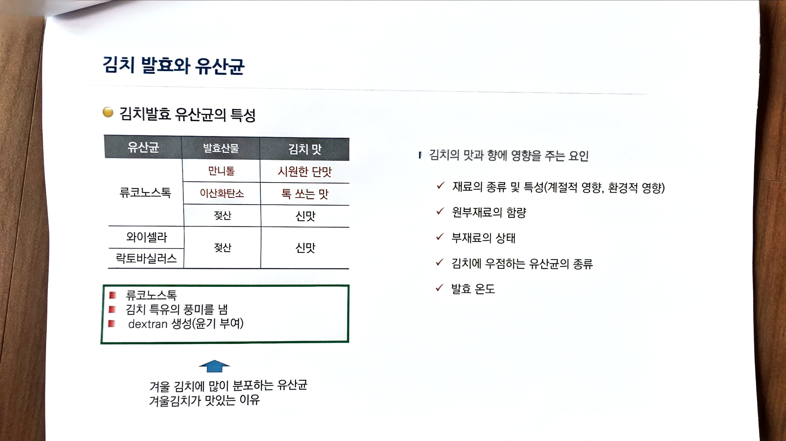

# 07. 김치 발효와 유산균

> 원본 스캔: `07_김치_발효와_유산균.jpg`

## 김치발효 유산균의 특성

| 유산균 | 발효산물 | 김치 맛 |
|---|---|---|
| 류코노스톡 | 만니톨 | 시원한 단맛 |
| 류코노스톡 | 이산화탄소 | 톡 쏘는 맛 |
| 류코노스톡 | 젖산 | 신맛 |
| 와이셀라 / 락토바실러스 | 젖산 | 신맛 |

(류코노스톡은 만니톨·이산화탄소·젖산 3행에 걸쳐 하나로 묶여 있고, 와이셀라와 락토바실러스는 젖산·신맛 한 행에 함께 묶여 있음)

**[녹색 상자]**
- 류코노스톡
- 김치 특유의 풍미를 냄
- dextran 생성(윤기 부여)

↑ (위쪽 파란 화살표)
겨울 김치에 많이 분포하는 유산균
겨울김치가 맛있는 이유

## 김치의 맛과 향에 영향을 주는 요인

- ✓ 재료의 종류 및 특성(계절적 영향, 환경적 영향)
- ✓ 원부재료의 함량
- ✓ 부재료의 상태
- ✓ 김치에 우점하는 유산균의 종류
- ✓ 발효 온도
