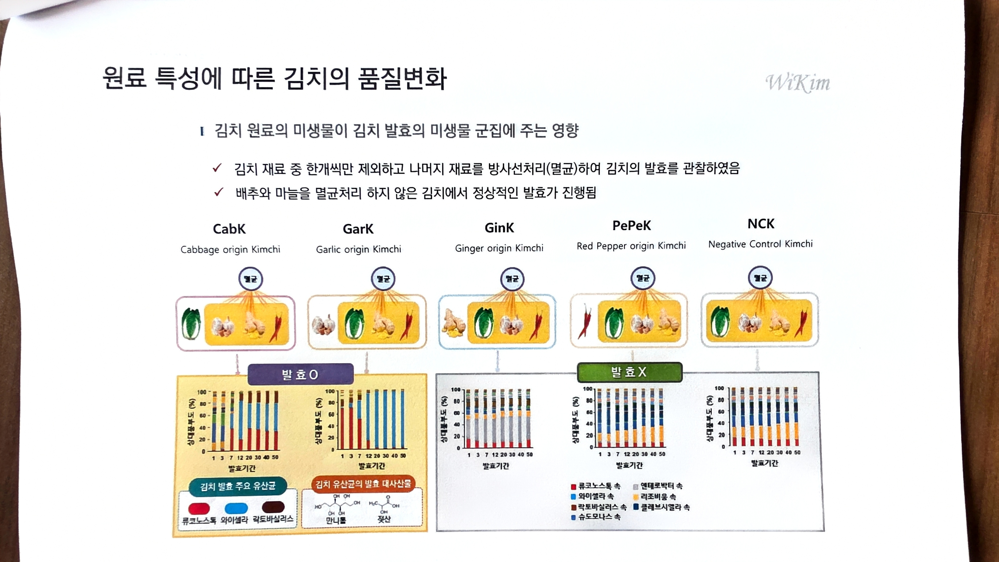

# 08. 원료 특성에 따른 김치의 품질변화

> 원본 스캔: `08_원료특성에_따른_김치_품질변화.jpg`

원료 특성에 따른 김치의 품질변화

(우측 상단 워터마크: WiKim)

- **김치 원료의 미생물이 김치 발효의 미생물 군집에 주는 영향**
  - ✓ 김치 재료 중 한개씩만 제외하고 나머지 재료를 방사선처리(멸균)하여 김치의 발효를 관찰하였음
  - ✓ 배추와 마늘을 멸균처리 하지 않은 김치에서 정상적인 발효가 진행됨

## 실험군 (5종)

| 약어 | 영문명 |
|---|---|
| CabK | Cabbage origin Kimchi |
| GarK | Garlic origin Kimchi |
| GinK | Ginger origin Kimchi |
| PePeK | Red Pepper origin Kimchi |
| NCK | Negative Control Kimchi |

각 실험군은 **멸균** 처리 아이콘과 함께 재료(배추·마늘·생강·고추 등) 이미지가 표시되어 있음.

## 발효 결과 그룹

- **발효 O** : CabK, GarK (노란색 박스)
- **발효 X** : GinK, PePeK, NCK (회색 박스)

## 그래프 (막대그래프, 실험군별)

- 그래프 제목/축: 세로축 = **상대풍부도 (%)**, 눈금 0 · 20 · 40 · 60 · 80 · 100
- 가로축 = **발효기간**, 눈금 1 · 3 · 7 · 12 · 20 · 30 · 40 · 50
- 형태: 발효기간별 미생물 군집 상대풍부도를 나타낸 누적 막대그래프(stacked bar)
- 각 실험군(CabK, GarK, GinK, PePeK, NCK)마다 개별 누적 막대그래프가 제시됨

## 범례

### 발효 O 그룹 범례 (노란색 박스)

- **김치 발효 주요 유산균**
  - 류코노스톡 (빨강)
  - 와이셀라 (파랑)
  - 락토바실러스 (진한 적갈색)
- **김치 유산균의 발효 대사산물** (화학구조식 표시)
  - 만니톨
  - 젖산

### 발효 X 그룹 범례 (회색 박스, 7종)

| 색상 | 항목 |
|---|---|
| 빨강 | 류코노스톡 속 |
| 하늘색 | 와이셀라 속 |
| 적갈색 | 락토바실러스 속 |
| 파랑 | 슈도모나스 속 |
| 회색 | 엔테로박터 속 |
| 주황 | 리조비움 속 |
| 진한 남색 | 클레브시엘라 속 |
