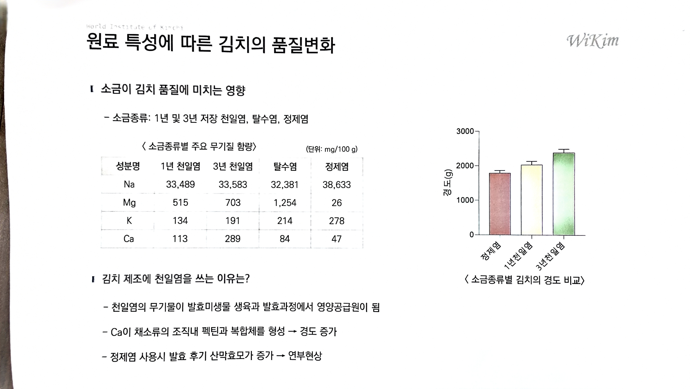

# 09. 원료 특성에 따른 김치의 품질변화

> 원본 스캔: `09_원료특성_김치_품질변화.jpg`

- 소금이 김치 품질에 미치는 영향

  - 소금종류: 1년 및 3년 저장 천일염, 탈수염, 정제염

〈 소금종류별 주요 무기질 함량〉 (단위: mg/100 g)

| 성분명 | 1년 천일염 | 3년 천일염 | 탈수염 | 정제염 |
|---|---|---|---|---|
| Na | 33,489 | 33,583 | 32,381 | 38,633 |
| Mg | 515 | 703 | 1,254 | 26 |
| K | 134 | 191 | 214 | 278 |
| Ca | 113 | 289 | 84 | 47 |

- 김치 제조에 천일염을 쓰는 이유는?

  - 천일염의 무기물이 발효미생물 생육과 발효과정에서 영양공급원이 됨

  - Ca이 채소류의 조직내 펙틴과 복합체를 형성 → 경도 증가

  - 정제염 사용시 발효 후기 산막효모가 증가 → 연부현상

**막대그래프: 〈 소금종류별 김치의 경도 비교〉**

- Y축: 경도(g), 눈금 0 / 1000 / 2000 / 3000
- X축(계열): 정제염, 1년천일염, 3년천일염
- 값(오차막대 포함, 그래프 판독 근사치):
  - 정제염 ≈ 1,800 g
  - 1년천일염 ≈ 2,020 g
  - 3년천일염 ≈ 2,380 g
- 경향: 정제염 < 1년천일염 < 3년천일염 (경도 증가)

*(우상단 로고: WiKim / World Institute of Kimchi)*
