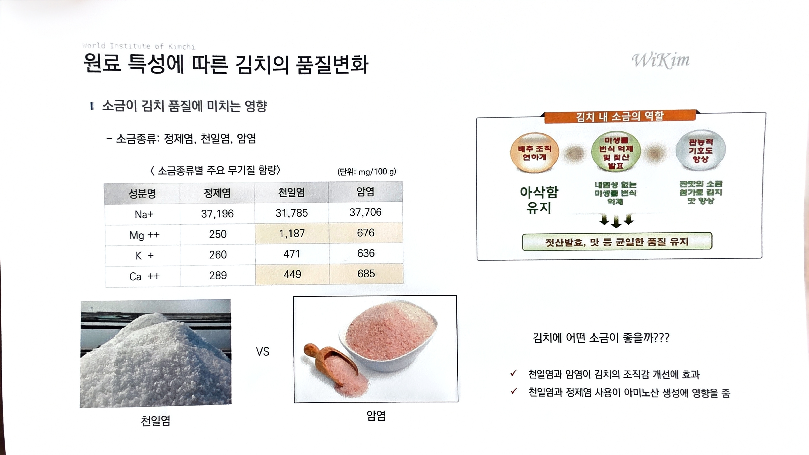

# 10. 원료 특성에 따른 김치의 품질변화

> 원본 스캔: `10_원료특성_김치_품질변화.jpg`

World Institute of Kimchi

## ■ 소금이 김치 품질에 미치는 영향

- 소금종류: 정제염, 천일염, 암염

### 〈 소금종류별 주요 무기질 함량〉 (단위: mg/100 g)

| 성분명 | 정제염 | 천일염 | 암염 |
|---|---|---|---|
| Na+ | 37,196 | 31,785 | 37,706 |
| Mg ++ | 250 | 1,187 | 676 |
| K + | 260 | 471 | 636 |
| Ca ++ | 289 | 449 | 685 |

(사진) 천일염 　VS　 암염

## 김치 내 소금의 역할

- 배추 조직 연하게 → **아삭함 유지**
- 미생물 번식 억제 및 젓산 발효 → **내염성 없는 미생물 번식 억제**
- 관능적 기호도 향상 → **짠맛의 소금 첨가로 김치 맛 향상**

↓ ↓ ↓

**젓산발효, 맛 등 균일한 품질 유지**

## 김치에 어떤 소금이 좋을까???

- ✓ 천일염과 암염이 김치의 조직감 개선에 효과
- ✓ 천일염과 정제염 사용이 아미노산 생성에 영향을 줌
