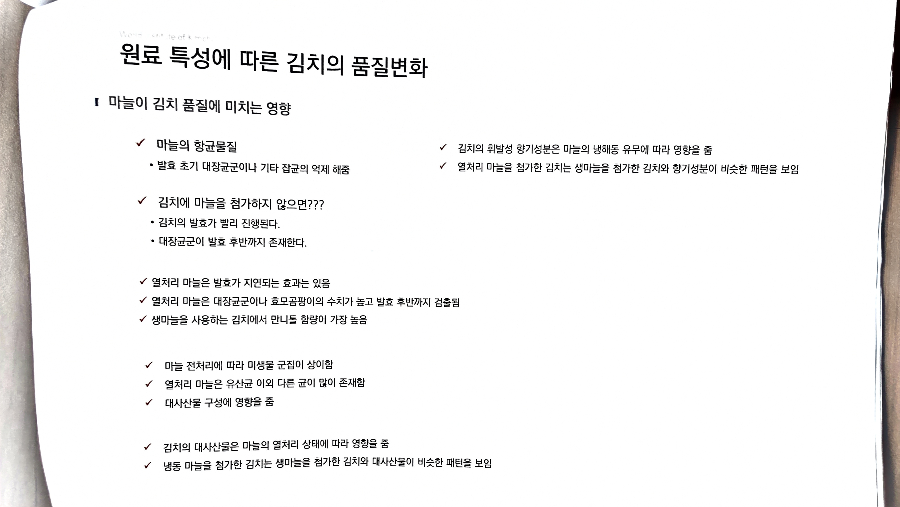

# 11. 원료 특성에 따른 김치의 품질변화

> 원본 스캔: `11_원료특성_김치_품질변화.jpg`

*(슬라이드 상단 좌측 흐린 머리글: "World Institute of Kimch[i]" [일부 판독 곤란])*

**❚ 마늘이 김치 품질에 미치는 영향**

- ✓ 마늘의 항균물질
  - 발효 초기 대장균군이나 기타 잡균의 억제 해줌

- ✓ 김치에 마늘을 첨가하지 않으면???
  - 김치의 발효가 빨리 진행된다.
  - 대장균군이 발효 후반까지 존재한다.

- ✓ 열처리 마늘은 발효가 지연되는 효과는 있음
- ✓ 열처리 마늘은 대장균군이나 효모곰팡이의 수치가 높고 발효 후반까지 검출됨
- ✓ 생마늘을 사용하는 김치에서 만니톨 함량이 가장 높음

- ✓ 마늘 전처리에 따라 미생물 군집이 상이함
- ✓ 열처리 마늘은 유산균 이외 다른 균이 많이 존재함
- ✓ 대사산물 구성에 영향을 줌

- ✓ 김치의 대사산물은 마늘의 열처리 상태에 따라 영향을 줌
- ✓ 냉동 마늘을 첨가한 김치는 생마늘을 첨가한 김치와 대사산물이 비슷한 패턴을 보임

- ✓ 김치의 휘발성 향기성분은 마늘의 냉해동 유무에 따라 영향을 줌
- ✓ 열처리 마늘을 첨가한 김치는 생마늘을 첨가한 김치와 향기성분이 비슷한 패턴을 보임
