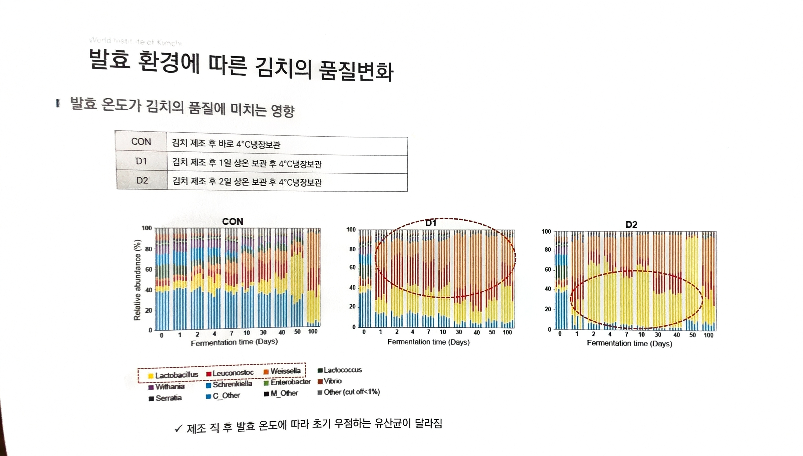

# 12. 발효 환경에 따른 김치의 품질변화

> 원본 스캔: `12_발효환경에_따른_김치의_품질변화.jpg`

*(좌측 상단 워터마크: World Institute of Kimchi)*

## ▌발효 온도가 김치의 품질에 미치는 영향

| 구분 | 처리 조건 |
|---|---|
| CON | 김치 제조 후 바로 4°C냉장보관 |
| D1 | 김치 제조 후 1일 상온 보관 후 4°C냉장보관 |
| D2 | 김치 제조 후 2일 상온 보관 후 4°C냉장보관 |

### 그래프: 미생물 군집 변화 (CON / D1 / D2 3개 패널)

- **그래프 형태:** 누적 막대 그래프(stacked bar chart) 3개 — CON, D1, D2
- **Y축:** Relative abundance (%), 눈금 0 / 20 / 40 / 60 / 80 / 100
- **X축:** Fermentation time (Days), 눈금 0 / 1 / 2 / 4 / 7 / 10 / 30 / 40 / 50 / 100

**범례(속, genus 단위):**

| 색 | 속 이름 |
|---|---|
| 노랑 | Lactobacillus |
| 빨강 | Leuconostoc |
| 주황 | Weissella |
| 진초록 | Lactococcus |
| 보라 | Withania |
| 파랑 | Schrenkiella |
| 초록 | Enterobacter |
| 갈색(진빨강) | Vibrio |
| 검정 | Serratia |
| 파랑 | C_Other |
| 검정 | M_Other |
| 회색 | Other (cut off<1%) |

- **강조 표시:** 범례에서 **Lactobacillus**(노랑)가 빨간 점선 상자로 강조됨.
- **D1 그래프:** 그래프 상단~중앙 영역에 빨간 점선 타원 강조 표시.
- **D2 그래프:** 그래프 하단~중앙 영역에 빨간 점선 타원 강조 표시(노란색 Lactobacillus 우점 구간).
- **CON 그래프:** 별도 타원 강조 없음.

✓ 제조 직 후 발효 온도에 따라 초기 우점하는 유산균이 달라짐
