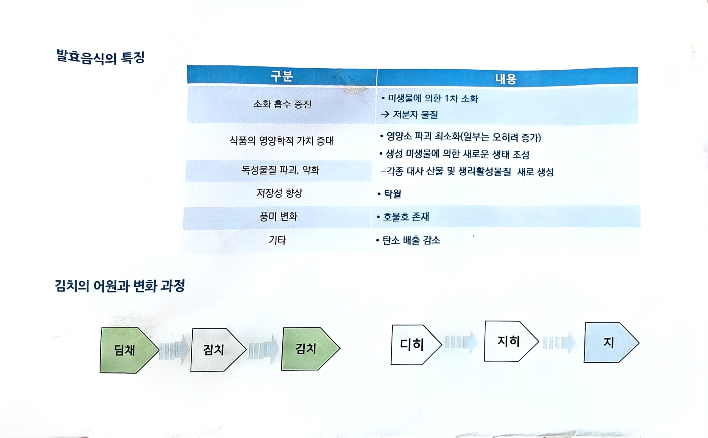

# 13. 발효음식의 특징 / 김치의 어원과 변화 과정

> 원본 스캔: `13_발효음식_특징_김치_어원.jpg`

## 발효음식의 특징

| 구분 | 내용 |
|---|---|
| 소화 흡수 증진 | • 미생물에 의한 1차 소화 → 저분자 물질 |
| 식품의 영양학적 가치 증대 | • 영양소 파괴 최소화(일부는 오히려 증가) • 생성 미생물에 의한 새로운 생태 조성 |
| 독성물질 파괴, 약화 | −각종 대사 산물 및 생리활성물질  새로 생성 |
| 저장성 향상 | • 탁월 |
| 풍미 변화 | • 호불호 존재 |
| 기타 | • 탄소 배출 감소 |

## 김치의 어원과 변화 과정

- 딤채 → 짐치 → 김치
- 디히 → 지히 → 지
